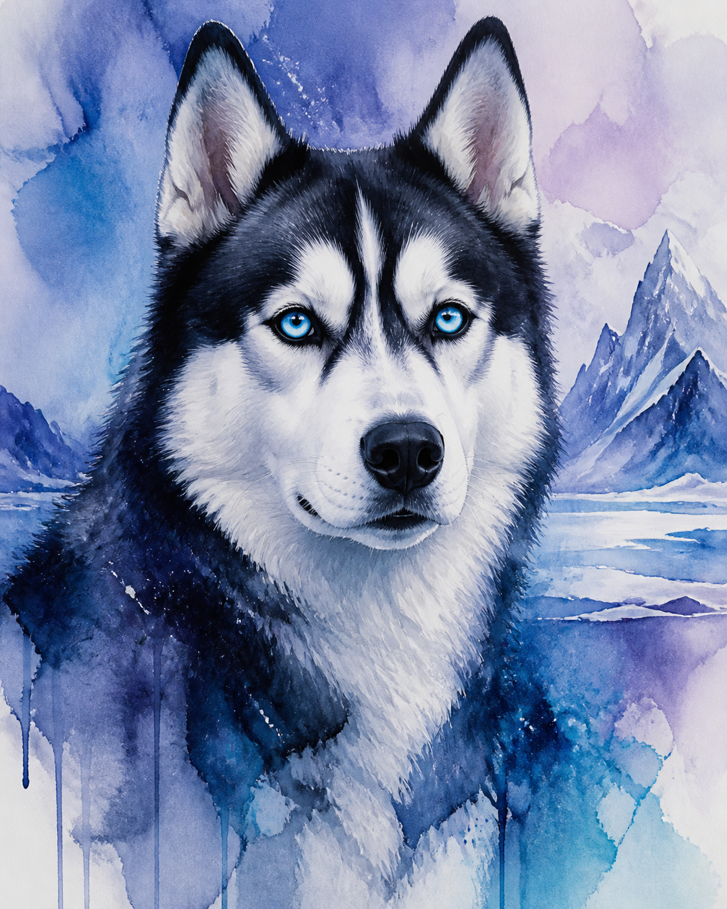
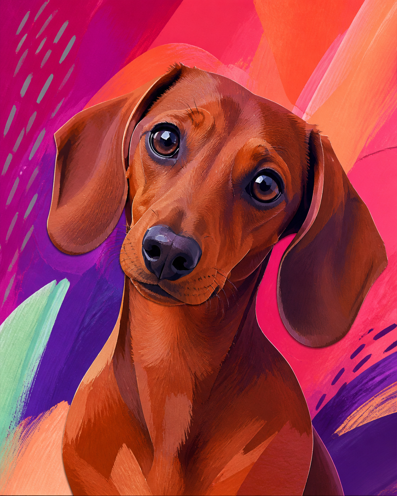
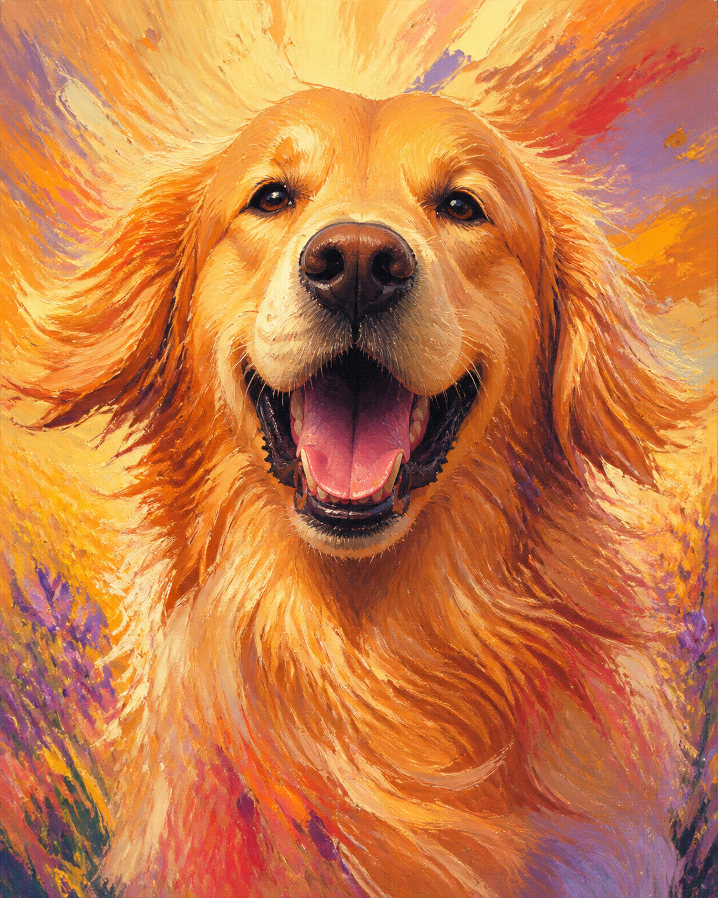
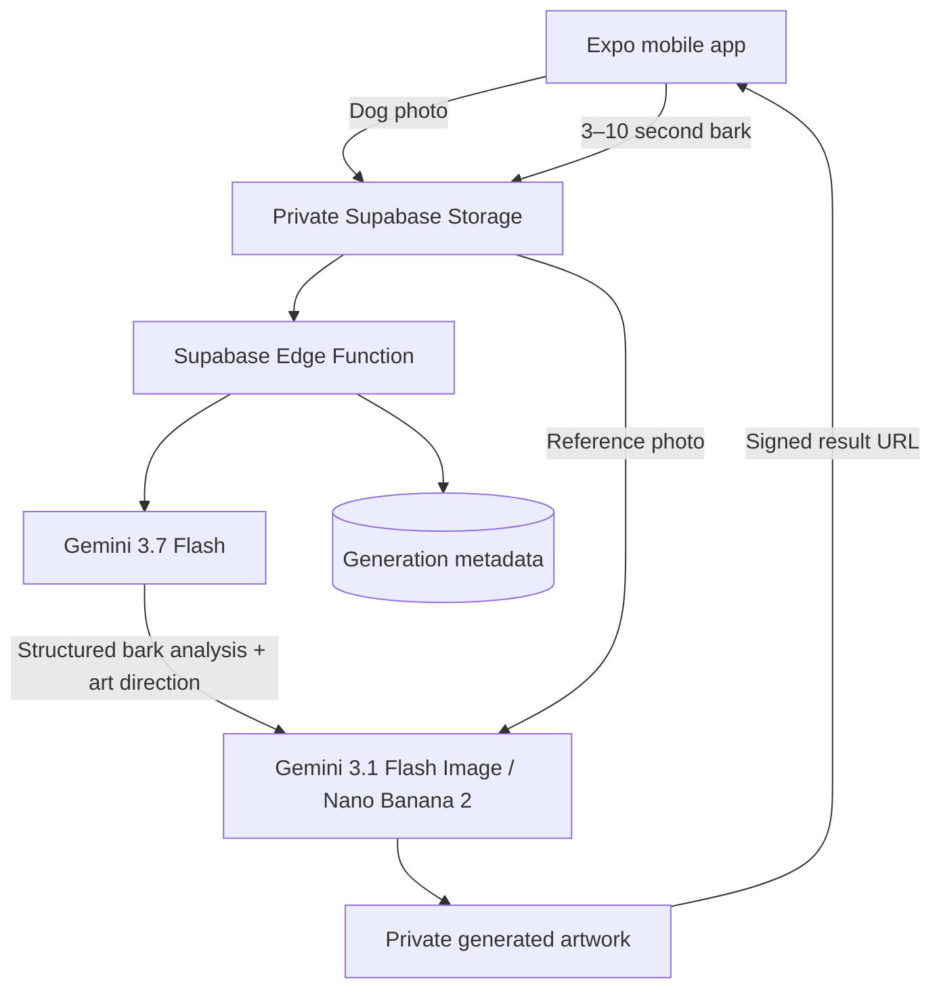

<div align="center">
  

  # PawArt

  ### Every bark becomes art.

  **Your dog. Their bark. Their masterpiece.**

  <p>
    
    
    
    
  </p>

  Built for the **DEV Weekend Challenge: Dog Days Edition**<br />
  Competing for **Best Use of Google AI**
</div>

---

## What is PawArt?

PawArt is a mobile creative studio that turns a dog's photo and a short bark recording into a recognizable, one-of-a-kind portrait.

The bark is not treated as a secret language. PawArt measures acoustic characteristics—energy, pitch, rhythm, intensity, bark count, pauses, and duration—and uses them as creative controls for palette, composition, contrast, and brushwork.

> PawArt never claims to translate a dog's thoughts, needs, intentions, or emotions. Sound characteristics guide the artwork only.

## The experience

| Step | What happens |
| --- | --- |
| **01 · Add a photo** | Take a clear dog photo or choose one from the gallery. |
| **02 · Record the bark** | Capture 3–10 seconds with a live microphone waveform. |
| **03 · Read the sound** | Gemini analyzes measurable acoustic characteristics. |
| **04 · Find the art direction** | Sound features become a structured visual brief. |
| **05 · Paint the portrait** | Nano Banana 2 preserves the dog while applying the bark-driven direction. |
| **06 · Keep the masterpiece** | Explore the bark fingerprint, replay, save, or share. |

## A glimpse of the PawArt world

<table>
  <tr>
    <td width="33%"></td>
    <td width="33%"></td>
    <td width="33%"></td>
  </tr>
  <tr align="center">
    <td><strong>Luna</strong><br />Soft · Airy · Gentle</td>
    <td><strong>Poppy</strong><br />Bold · Playful · Textured</td>
    <td><strong>Sunny</strong><br />Warm · Expressive · Alive</td>
  </tr>
</table>

## Bark-to-art mapping

Different recordings should produce meaningfully different creative directions.

| Acoustic characteristic | Artistic influence |
| --- | --- |
| Higher energy | More dynamic composition |
| Lower energy | Calmer, more spacious composition |
| Higher pitch | Brighter palette |
| Lower pitch | Deeper colors |
| Rapid rhythm | More energetic brushwork |
| Slower rhythm | Softer, more open treatment |
| Strong intensity | Bolder contrast |
| Gentle intensity | Subtle texture |

These are creative mappings—not behavioral or emotional conclusions.

## Architecture



The Expo app communicates with Supabase only. Google credentials remain in server-side Edge Function secrets and are never bundled into the mobile application.

## Technology

### Mobile

- Expo SDK 54
- React Native and TypeScript
- Expo Audio with live recording metering
- Expo Image Picker, Media Library, File System, and Sharing

### Backend

- Supabase Postgres
- Private Supabase Storage buckets
- Supabase Edge Functions
- Row Level Security
- Time-limited signed result URLs

### Google AI

- **Gemini 3.7 Flash** — multimodal bark analysis and structured art direction
- **Gemini 3.1 Flash Image (Nano Banana 2)** — reference-preserving portrait generation

## Local setup

### 1. Requirements

- Node.js LTS
- npm
- Expo Go or an Android/iOS simulator
- A Supabase project
- A Google AI API key
- Supabase CLI access

### 2. Clone and install

```bash
git clone git@github.com:abbasmir12/pawart.git
cd pawart
npm install
```

### 3. Configure the Expo environment

```bash
cp .env.example .env
```

Add your public Supabase client configuration:

```env
EXPO_PUBLIC_SUPABASE_URL=https://YOUR_PROJECT_REF.supabase.co
EXPO_PUBLIC_SUPABASE_PUBLISHABLE_KEY=YOUR_SUPABASE_PUBLISHABLE_KEY
```

The Supabase URL and publishable key are client configuration. Never place `GOOGLE_AI_API_KEY` or a Supabase secret/service-role key in `.env` or any `EXPO_PUBLIC_*` variable.

## Supabase setup

### 1. Authenticate and link the project

```bash
npx supabase@latest login
npx supabase@latest link --project-ref YOUR_PROJECT_REF
```

### 2. Apply the database and storage migration

```bash
npx supabase@latest db push
```

The migration creates everything required by the MVP:

- `generations` metadata table with RLS enabled
- Private `dog-photos` bucket
- Private `bark-recordings` bucket
- Private `pawart-results` bucket
- Narrow anonymous upload policies for accepted source-media formats
- File-size and MIME-type restrictions

### 3. Add the Google AI secret

```bash
npx supabase@latest secrets set \
  GOOGLE_AI_API_KEY=YOUR_GOOGLE_AI_API_KEY
```

You can also add this secret from **Supabase Dashboard → Edge Functions → Secrets**.

### 4. Deploy the generation function

The secure server orchestrator belongs at:

```text
supabase/functions/generate-pawart/index.ts
```

Deploy it with:

```bash
npx supabase@latest functions deploy generate-pawart --no-verify-jwt
```

Authentication is intentionally omitted for this hackathon MVP. Before a public production release, enable app authentication or another request-verification mechanism, plus rate limiting and abuse protection.

### 5. Start PawArt

```bash
npm start
```

Scan the QR code with Expo Go, or launch a simulator:

```bash
npm run android
npm run ios
```

## Supabase data model

<details>
  <summary><strong>generations table</strong></summary>

| Field | Purpose |
| --- | --- |
| `id` | Generation UUID |
| `dog_name` | Display name used by the result screen |
| `photo_path` | Private source-photo path |
| `bark_audio_path` | Private bark-recording path |
| `energy` | Normalized acoustic energy, 0–100 |
| `pitch` | Classified pitch range |
| `rhythm` | Classified temporal rhythm |
| `intensity` | Classified acoustic intensity |
| `bark_count` | Distinct bark count |
| `pauses` | Detected pause count |
| `duration_seconds` | Recording duration |
| `art_style` | Generated visual style |
| `art_direction` | Complete structured visual brief |
| `generated_image_path` | Private generated-result path |
| `created_at` | Creation timestamp |

</details>

## Security model

- Google credentials are read only from Supabase Edge Function secrets.
- Source photos, bark recordings, and generated results use private buckets.
- The mobile client can upload accepted source files but cannot list or read private inputs.
- Database writes are performed by the server-side Supabase client.
- Generated artwork is returned through a six-hour signed URL.
- Server validation restricts dog names, paths, formats, and recording duration.
- `.env`, local Supabase state, third-party references, and server secrets are Git-ignored.

## Project structure

```text
PawArt/
├── App.tsx                         App state and screen flow
├── assets/
│   ├── brand/                      PawArt identity
│   ├── gallery/                    Showcase artwork
│   └── illustrations/              Original app illustration
├── docs/
│   ├── DEMO_SCRIPT.md              Fast judging walkthrough
│   └── DEV_SUBMISSION.md           DEV submission draft
├── src/
│   ├── components/                 Buttons, shells, decorations, waveform
│   ├── lib/                        Supabase client and generation workflow
│   ├── screens/                    Complete mobile experience
│   ├── theme.ts                    PawArt visual tokens
│   └── types.ts                    Shared application types
└── supabase/
    ├── migrations/                 Database, Storage, and RLS setup
    └── functions/                  Secure Google AI orchestration
```

## Development commands

```bash
npm run typecheck       # Validate TypeScript
npm run check           # TypeScript + Expo Doctor
npm start -- --clear    # Restart Expo with a clean Metro cache
```

## Hackathon scope

PawArt is deliberately focused on one memorable interaction:

```text
Photo → Bark → Acoustic analysis → Art direction → Dog portrait
```

No subscriptions, payments, social feeds, profiles, followers, or unnecessary dashboards. The goal is to make the central experience understandable within seconds and delightful from start to finish.

## Responsible AI and design disclosure

AI-assisted development was used while building PawArt. The PawArt icon was generated specifically for this project with OpenAI image generation. PawArt itself uses Google Gemini models for bark analysis, structured art direction, and artwork generation. Generated Google images include SynthID watermarking.

The interface draws inspiration from modern pet, wellness, fitness, and creative-studio products. PawArt's brand, copy, screen flow, components, assets, and product interaction were created specifically for this project.

---

<div align="center">
  <strong>PawArt</strong><br />
  Every bark becomes art.<br /><br />
  Made with 🐾 by <a href="https://github.com/abbasmir12">Abbas Mir</a>
</div>
